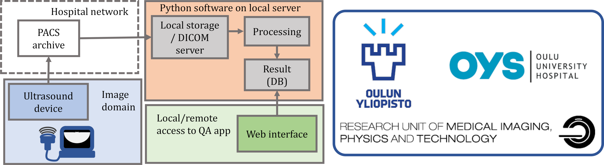
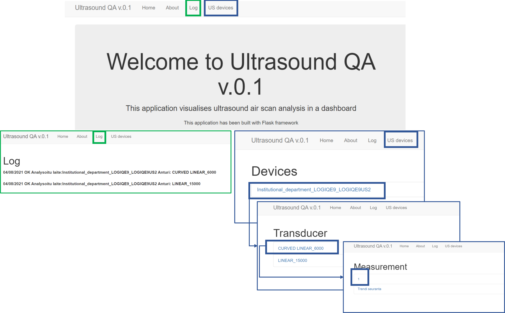
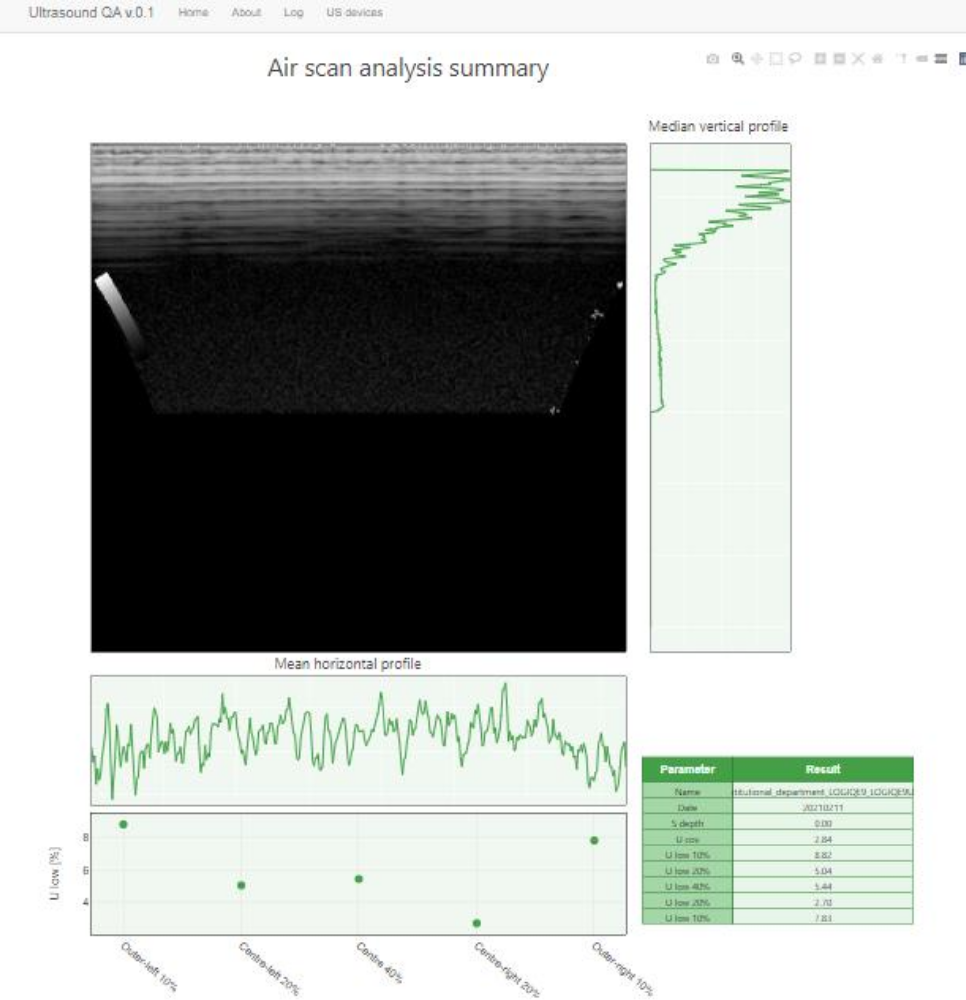

<!-- PROJECT LOGO -->
<br />
<p align="center">
  <a href="https://github.com/MIPT-Oulu/Ultrasound_IQ_analysis/"> <!-- mikäli Gihubiin niin päivitä!-->
      <!-- mikäli Gihubiin niin päivitä!-->
  </a>

  <h2 align="center">Automaattinen ultraääni-ilmakuvien analyysi</h2>

  <p align="center">
    Ultraääni-ilmakuville automaattinen analyysiohjelmisto ja web-selainpohjainen tulosten tarkasteluohjelma
    <br />
    <a href="https://github.com/MIPT-Oulu/Ultrasound_IQ_analysis/tree/main/QA_analysis/documentation"><strong>Dokumentaatio analyysiohjelma »</strong></a>  <!-- mikäli Gihubiin niin päivitä!-->
  <br />
  <a href="https://github.com/MIPT-Oulu/Ultrasound_IQ_analysis/tree/main/Visualization_app/documentation"><strong>Dokumentaatio visualisointiohjelma »</strong></a>  <!-- mikäli Gihubiin niin päivitä!-->
    <br />
    <br />
    <a href="https://github.com/MIPT-Oulu/Ultrasound_IQ_analysis/issues">Raportoi Bugi</a>  <!-- mikäli Gihubiin niin päivitä!-->
    
  </p>
</p>


<!-- TABLE OF CONTENTS -->
<details open="open">
  <summary><h2 style="display: inline-block">Sisällysluettelo</h2></summary>
  <ol>
    <li>
      <a href="#Tietoa-projektista">Tietoa projektista</a>
    </li>
    <li>
      <a href="#Alkuasetukset">Alkuasetukset</a>
    </li>
    <li><a href="#Käyttö">Käyttö</a></li>
    <li><a href="#Lisenssi">Lisenssi</a></li>
    <li><a href="#Acknowledgements">Acknowledgements</a></li>
    <li><a href="#Yhteystiedot">Yhteystiedot</a></li>
  </ol>
</details>


<!-- ABOUT THE PROJECT -->
## Tietoa projektista

Tavoitteena oli tehdä  [Horssen et al. 2017](https://doi.org/10.1177/1742271X17733145) tutkimuksen mukainen automaattinen analyysiohjelmisto, jonka avulla käyttäjä voi suorittaa ultraääni-ilmakuville automaattisen kuvanlaatuanalyysin reverberaatiokuviin perustuen.

Projektin analyysi jakautuu kahteen osaan: 
1. [Ultraääni-ilmakuvien automaattiseen analyysiin](https://github.com/MIPT-Oulu/Ultrasound_IQ_analysis/tree/main/QA_analysis)
2. [Web-selainpohjaiseen tulosten tarkasteluohjelmaan](https://github.com/MIPT-Oulu/Ultrasound_IQ_analysis/tree/main/Visualization_app)

*Huom: Vaikka tulosten tarkasteluohjelma on selainpohjainen, ohjelmistoa ei kuitenkaan ole testattu kuin paikallisesti selaimessa eikä web-serverikäytössä.*


<!-- GETTING STARTED -->
## Alkuasetukset

Ohjelmisto on toteutettu Pythonilla (v3.8) ja tiedostosta `requirements.txt` löytyy listattuna  on vaadittavat python kirjastomoduulit. 

**Ohjelmiston lataus ja uuden virtuaaliympäristön luonti**
1. Kloonaa repository:
   ```sh
   git clone https://github.com/MIPT-Oulu/Ultrasound_IQ_analysis.git
   ```
2. Mene root hakemistoon jossa `requirements.txt` sijaitsee:
   ```sh
   cd ..\Ultrasound_IQ_analysis\
   ```
3. Asenna kirjastot omaan virtuaaliympäristöön conda:a käyttäen:
```
    conda env create --file py38.yml
    conda activate py38
```

*.../Ultrasound_IQ_analysis/QA_analysis/data/* hakemistosta löytyy kaksi erilaista ultraääni-ilmakuva esimerkkikuvaa, joilla ohjelmiston toimintaa voi testata. 

Tämä ohjelmisto ei tue kuvien hakemista sairaalan PACS-järjestelmästä suoraan. [Pynetdiccom](https://pydicom.github.io/pynetdicom/stable/index.html) kirjaston avulla voi tehdä DICOM -verkkoprotokollan analyysikoneelle.

Kuvien hakeminen PACS-järjestelmästä voi toteuttaa esimerkiksi avoimella [k-PACS ohjelmistolla](https://image-systems.biz/products/free-dicom-pacs-tools/k-pacs/).
Käyttäjän pitää määrittää hakemistosijainti (k-PACS ohjelmistossa *..\imagebox*), jonne DICOM tiedostot laatukuvista saapuvat ja johon watchdog kuuntelijan polku asetetaan.
Analyysiohjelma kuuntelee hakemistoon saapuneita tiedostoja ja mikäli kyseessä on ultraäänikuva dicom-tietosto, suorittaa ohjelmisto automaattisen laatuanalyysin. 

<!-- USAGE EXAMPLES -->

## Käyttö
Ohjelmiston käyttö voidaan jakaa kahteen osaan 1. analyysiohjelmaan ja  2. tulosten tarkasteluohjelmaan.  

### 1. Ilmakuvien automaattisen analyysiohjelman toiminta ja käyttö
#### Toimintaperiaate lyhyesti
/QA_analysis/main.py tiedostoa ajamalla käynnistetään automaattinen analyysiohjelmisto (ks seuraava osio *käyttö* tarkempi ohjeistus ensin). Se pohjautuu [watchdog](https://pypi.org/project/watchdog/) kuuntelijaan, joka kuuntelee hakemistopolkua, johon laatukuvat tulevat. Mikäli hakemistopolkuun ilmestyy uusi tiedosto aloitetaan kuvalle analyysi. Ennen analyysia tarkistetaan että tiedosto on DICOM tyyppiä (on .dcm pääte) ja että kuva on ultraääni-ilmakuva (PatientID on oikeaa muotoa, joka määritellään `Settings.yaml` tiedostossa). Tämän jälkeen kuvasta analysoidaan samat parametrit mitä Horssen et al. 2017 työssä on kuvattu ja ne tallenetaan tuloshakemistoon pohjautuen seuraavanlaiseen kansiohierarkkiaan:  

 ```
+-- path_save
|   +-- Instituutio_laitevalmistaja_laitteennimi
|        +-- Transducer_1
|             1
|             2 ... etc.
|        +-- Transducer_2
|        +-- Transducer_3 ... etc.
|   +--   Instituutio2_laitevalmistaja2_laitteennimi2
|        +-- Transducer_1
|             1
|             2 ... etc.
|        +-- Transducer_2 ... etc.
 ```
Eli siis jokaisen laitteen anturille tulee oma kansionsa johon eri aikapisteen mittaukset tallennetaan juoksevalla numeroinnilla.
Nimi attribuutit haetaan automaattisesti kuvan dicom tiedoista. Mikäli tieto puuttuu niin se korvataan jollakin geneerisella tunnisteella. Kuitenkin on tärkeää että jokaisen ultraäänilaitteen voi suoraan tunnistaan dicom attribuuteista, jotta järjestelyhierarkkia voidaan toteuttaa automaattisesti. Järjestelyhierarkkiaa käytetään hyödyksi tulosten katseluohjelmassa.

`Instituutio_laitevalmistaja_laitteennimi`=  Institutional Department Name Attribute  + _ + Manufacturer's Model Name Attiribute+ _ + Station Name Attribute  
`Transducer_1` = TransducerType Attribute + _ + Transducer Frequency Attribute  
Tiedostonumero esim. `1` sisältää python dictionaryn, johon analyysitulokset ovat tallennettu. 

Huom: On hyvin tyypillistä että dicom tietoja jää uupumaan jos esimerkiksi UÄ-kuvat siirretään analyysikoneelle edustapalvelimen kautta ilman lähetettä. 
`LUT.xls` on manuaalinen look-up-taulukko, jota käytetään silloin jos anturin nimeä ei löydy metatiedoista. Nimi yhdistetään Physical deltaX ja Physical deltaY parametrien
avulla (oletus että ne löytyvät metatiedoista mikäli anturin nimi puuttuu). Lisätietoja [dokumentaatiosta](https://github.com/MIPT-Oulu/Ultrasound_IQ_analysis/tree/main/QA_analysis/documentation).

#### Käyttö
**Ennen ohjelman käyttöönottoa:**  
Mene hakemistoon *Ultrasound_IQ_analysis/QA_analysis* ja avaa `Settings.yaml` tiedosto.  
Käyttäjän pitää määritellä seuraavat tiedot:  
* *data_path:*  tiedostosijanti, johon dicom tiedostot tulevat. **HOX: Python tiedostonimi käyttää linux notaatiota eli vinoviivaa (/) EI kenoviivaa. Nimen loppussa pitää myös olla vinoviiva eli  ../XX/ZZ/**  
* *save_path:* tiedosto jonne analyysitulokset tallennetaan.   **HOX: Python tiedostonimi käyttää linux notaatiota eli vinoviivaa (/) EI kenoviivaa.**
* *threshold_val:* (prosenttiluku 10%), joka on kynnystysarvo mittaustuloksen ja nykyisen mittautuloksen välisen suhteellisen eron välille. Mikäli virhe on suurempi kuin asetettu luku kirjautuu *log_file.txt* tiedostoon lisätietoja poikkeamasta, joka voi tarkastella myös tarkasteluohjelmassa.  
* *id_us_analysis:*  Esim. *112233ULTRA* Patient ID tunniste joka pitää laatukuvaa otettaessa asettaa oikein.
* *path_LUT_table:* Hakemistopolku `LUT.xls` taulukkoon.

**Ohjelman ajaminen komentoriviltä (windows anaconda prompt, linux terminal tms.):**
1. Aktivoi python virtuaaliympäristö: 
    ```
    conda activate py38
    ```
2. Mene hakemistoon, jossa sovellus (main.py) sijaitsee: 
    ```
    cd ...\QA_analysis
    ```
3. Käynnistä ohjelma:
    ```
    python main.py
    ```
4. Ohjelman toimintaa testataksesi Cut+paste esimerkkitiedostot [Ultrasound_IQ_analysis/QA_analysis/data] (https://github.com/MIPT-Oulu/Ultrasound_IQ_analysis/tree/main/QA_analysis/data) `path_data` sijaintiin (Hox! Jos tiedostot ovat jo kansiossa, kun ohjelma käynnistyy ei analyysi starttaa. Tiedostot pitää siirtää hakemistosta pois ja siirtää takaisin hakemistoon jolloin analyysi käynnistyy).
  
### 2. Tulosten tarkasteluohjelman käyttö

#### Toimintaperiaate lyhyesti
Tulosten tarkasteluohjelman tarkoituksena on monitoroida ilmakuvien laatua. Se on tehty [Flask:lla](https://flask.palletsprojects.com/en/2.0.x/) ja toimii web-selaimessa. 
  

**Kuva 1.** Havainnekuva web-selainpohjaisesta analyysitulosten tarkasteluohjelman toiminnasta.  

Ohjelman käyttö on tehty hyvin yksinkertaiseksi, siten että valitaan yläreunan naviogintipalkista *Log* (kuva 1 vihreä), josta aukeaa lokitiedot analyyseistä. Tulosten tarkasteluun yläreunasta valitaan naviogintipalkista *Devices* (kuva 1 sininen), joka avaa laitelistauksen (ks kansiohierarkkia). Valitsemalla laitteen avautuu listaus antureista ja anturia painamalla avautuu listaus anturille tehdyistä mittauksista ja trendiseurannasta.

  

**Kuva 2.** Havainnekuva web-selainpohjaisesta analyysitulosten tarkasteluohjelman toiminnasta. Se on toteutettu [Plotly javascript](https://plotly.com/javascript/) kirjastolla.  

#### Käyttö
**Ennen ohjelman käyttöönottoa:**
Mene hakemistoon *Ultrasound_IQ_analysis/Visualization_app/* ja avaa `Settings.yaml` tiedosto.  
Käyttäjän pitää määritellä seuraavat tiedot:  
* *path_data:* Tiedostosijanti jossa analyysitulokset sijaitsevat.
* *path_log:* Sijainti jossa loki-tiedosto sijaitsee (oletus: `.../Ultrasound_IQ_analysis/QA_analysis/log.txt`).
*  *n_samples:* näytemäärä (4), joka määrittelee kuinka monesta edelliststä laatumittauksesta määritetään keskiarvo ja hajonta-arviot trendiseurantaan. Mikäli mittauksia on vähemmän kuin määritelty niin ohjelma ottaa niin monta mittausta statistiikan laskentaa on tehty.

Ohjelman ajaminen komentoriviltä (windows anaconda prompt, linux terminal):
1. aktivoi python virtuaaliympäristö: 
    ```
    conda activate py38
    ```
2. Mene hakemistoon, jossa sovellus [`.../Visualization_app/app.py`](https://github.com/MIPT-Oulu/Ultrasound_IQ_analysis/tree/main/Visualization_app) sijaitsee: 
    ```
    cd ...\Visualization_app
    ```
3. Käynnistä ohjelma:
    ```
    python app.py
    ```
4. Avaa selain ja kopioi lokaali http osoite selaimeen.  (Huom. ohjelmaa on vielä kehitysvaiheessa ja siksi se ei toimi Gunicorn tai vastaavan python verkkopalvelimen kautta.)


_Huom: Tarkempi kuvallinen suomenkielinen dokumentaatio ohjelmien toiminnasta löytyy [`.../QA_analysis/documentation`](https://github.com/MIPT-Oulu/Ultrasound_IQ_analysis/tree/main/QA_analysis/documentation) ja  [`.../Visualization_app/documentation` osioista._](https://github.com/MIPT-Oulu/Ultrasound_IQ_analysis/tree/main/Visualization_app/documentation)

<!-- Lisenssi -->
## Lisenssi
Tämä projekti on MIT lisensoitu. Ks. `LICENSE` osiosta lisätietoja. 

## Acknowledgements
Kiitokset Tampereen yliopistolliselle sairaalalle ultraääni-ilmakuva testiaineistosta.

<!-- Yhteystiedot -->
## Yhteystiedot

Projekti on toteutettu Oulun yliopistollisessa sairaalassa  ja Oulun yliopistossa lääketieteellisen, kuvantamisen  fysiikan ja  tekniikan tutkimusyksikössä.

Projektissa ovat mukana:  
Satu Inkinen - satu.inkinen [@] oulu.fi  
Tuomo Starck - tuomo.starck [@] ppshp.fi  
Matti Hanni  - matti.hanni [@] ppshp.fi  
Miika Nieminen - miika.nieminen [@] ppshp.fi  

Projektin linkki: [https://github.com/MIPT-Oulu/Ultrasound_IQ_analysis](https://github.com/MIPT-Oulu/Ultrasound_IQ_analysis)
